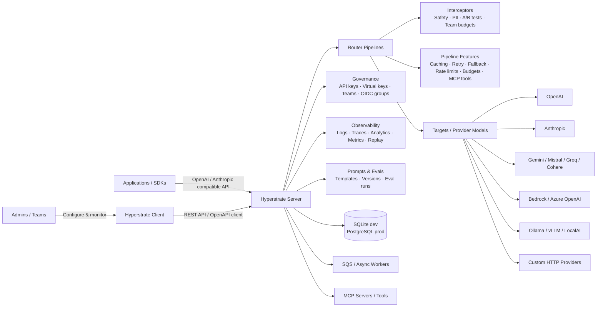

# Hyperstrate Server

<p align="center">
  <strong>Self-hosted enterprise AI gateway with model routing, provider orchestration, virtual keys, budgets, guardrails, evals, MCP tools, observability, and SDK-compatible APIs.</strong>
</p>

<p align="center">
  Route, govern, and observe production LLM traffic across hosted, self-hosted, OpenAI-compatible, Anthropic-compatible, native, streaming, async, and proxy inference flows.
</p>

<p align="center">
  <a href="https://github.com/Hyperstrate/server/actions/workflows/ci.yml"></a>
  <a href="LICENSE"></a>
  
  
  
  
</p>

---

## What Is Hyperstrate Server?

Hyperstrate Server is a self-hosted AI gateway for teams that need control over model routing, provider credentials, inference policy, spending limits, logs, prompts, evaluations, and multi-tenant access.

Pair it with [Hyperstrate Client](https://github.com/Hyperstrate/client), the Vue control plane for visually configuring providers, routers, prompts, evals, MCP tools, teams, virtual keys, SSO groups, analytics, and observability.

Use it when you want to:

- Put one gateway in front of OpenAI, Anthropic, Gemini, Mistral, Azure OpenAI, Bedrock, Groq, Cohere, Ollama, vLLM, LocalAI, Kling, or custom HTTP providers.
- Build routers from targets, pipeline features, and interceptors instead of hard-coding model selection into every app.
- Enforce request caps, cost budgets, rate limits, team access, API keys, virtual keys, and OIDC group mappings.
- Inspect each request with cost, latency, token usage, cache decisions, target selection, retries, fallbacks, tool calls, webhooks, and replay data.
- Run locally with SQLite or deploy as AWS Lambda functions backed by PostgreSQL and SQS.

## Highlights

| Area | What You Get |
| --- | --- |
| Gateway protocols | OpenAI Chat Completions, OpenAI Embeddings, Anthropic Messages, Hyperstrate native sync, streaming SSE, generic proxy |
| Router pipelines | Context trimming, caching, retry, fallback, rate limits, budgets, quality gates, semantic memory, MCP tools, rollout controls |
| Interceptors | Semantic routing, A/B tests, content filters, PII detection, prompt guard, prompt shield, team budgets |
| Governance | Organizations, users, teams, admin sessions, API keys, virtual keys, router team access, OIDC/JWKS exchange |
| Observability | Inference logs, pipeline traces, analytics, Prometheus metrics, audit logs, webhooks, CSV export, request replay |
| Evaluation | Named eval sets, exact/contains/LLM scoring, router regression runs, historical results |
| Async jobs | Local goroutine dispatcher for development, SQS dispatcher and Lambda worker for production |
| Deployment | Single local Go API, or SAM-managed API Lambda plus worker Lambda |

## Why Hyperstrate

| Need | Hyperstrate Approach |
| --- | --- |
| Own the gateway | MIT-licensed server you can run locally, in your cloud, or on AWS Lambda |
| Keep routing visible | Routers are made from targets, features, and interceptors that map directly to the client pipeline builder |
| Support existing SDKs | Provider-compatible proxy routes let OpenAI and Anthropic clients reuse the same integration point |
| Govern production traffic | Budgets, rate limits, virtual keys, team access, OIDC groups, content filters, PII handling, and prompt shields |
| Debug real requests | Pipeline traces show cache checks, interceptor decisions, target selection, retries, fallbacks, webhooks, and errors |
| Evaluate changes | Prompt/model experiments, evaluation sets, replay, feedback, and analytics live beside the runtime |

## Product Surface

### Routing Runtime

- Route traffic with `round_robin`, `weighted`, `percentage`, `failover`, `random`, or `latency_based` strategies.
- Add pipeline features for token optimization, context compression, exact and semantic caching, provider prompt caching, retry, fallback, health checks, request coalescing, hedging, rate limits, budgets, cost-aware routing, structured output, response fingerprinting, semantic memory, response prefetching, and prompt-policy rollout.
- Use interceptors before target selection for semantic classification, A/B tests, content filtering, PII handling, prompt guard, prompt shield, and team budget overflow routing.
- Expose routers through SDK-friendly proxy routes so existing OpenAI and Anthropic clients can point their `baseURL` at Hyperstrate.

### Models, Prompts, And Tools

- Register provider models from a built-in catalog and configure API keys, base URLs, timeouts, key rotations, and provider-specific options.
- Manage prompt templates with `{{variable}}` interpolation, version history, previews, and restore.
- Register org-scoped MCP servers and allow routers to call approved tools during pipeline execution.
- Track conversations, messages, and async jobs alongside normal gateway traffic.

### Observability And Evaluation

- Store inference logs with model, router, virtual key, team, cost, latency, token usage, errors, feedback, and optional request/response payloads.
- Capture pipeline steps for cache checks, interceptor decisions, target selection, retries, fallbacks, quality gates, and webhook delivery.
- Analyze usage by model, router, virtual key, cache behavior, A/B variant, error class, and latency percentile.
- Group agent traffic with `X-Agent-Session-Id`, `X-Agent-Client`, and `X-Agent-Turn-Index` headers.
- Run evaluation sets against routers and compare exact, substring, or LLM-judged scores over time.

## Quick Start

### Prerequisites

- Go 1.25+
- Atlas CLI for migration commands
- `gotestsum` for `make test`
- `swag` and Node.js when regenerating Swagger/OpenAPI docs

### Run Locally

```bash
git clone https://github.com/Hyperstrate/server.git
cd server

cp .env.dist .env

# Recommended for local development.
openssl rand -base64 64
# Paste the value into JWT_SECRET in .env.

go run ./cmd/api
```

The API starts on `http://localhost:8090` by default.

| URL | Purpose |
| --- | --- |
| `http://localhost:8090/healthz` | Health check |
| `http://localhost:8090/metrics` | Prometheus metrics |
| `http://localhost:8090/swagger/index.html` | Swagger UI |
| `http://localhost:8090/swagger/doc.json` | Swagger JSON |

On first launch, create the initial admin account through the client setup flow or call `POST /auth/setup`. The first user can become admin automatically, and `ADMIN_EMAIL` can force a specific email to always receive the admin role.

## Configuration

Configuration is read from `.env`, then `.env.local` as an override. When `APP_ENV=production`, dotenv files are ignored and values must come from the process environment.

| Variable | Default | Description |
| --- | --- | --- |
| `APP_ENV` | `development` | Set to `production` to require `JWT_SECRET` and skip dotenv loading |
| `PORT` | `8090` | HTTP listen port |
| `API_PUBLIC_URL` | empty | External API base URL used by generated Swagger docs |
| `DATABASE_DSN` | `file:hyperstrate-dev.db?cache=shared&_fk=1` | SQLite DSN for dev or PostgreSQL DSN for production |
| `JWT_SECRET` | insecure dev fallback | HS256 session signing secret. Required in production |
| `ADMIN_EMAIL` | empty | Email that always receives admin privileges |
| `FRONTEND_URL` | `http://localhost:8080` | Client URL used for CORS and OIDC redirects |
| `OIDC_JWKS_URL` | empty | JWKS endpoint used by `POST /auth/oidc/exchange` |
| `OIDC_PROVIDERS` | empty | Comma-separated provider labels for the client login UI |
| `OLLAMA_BASE_URL` | `http://localhost:11434` | Default base URL for `GET /ai/discover` when no `baseUrl` query is passed |
| `LOG_RETENTION_DAYS` | `90` | Retention window for inference logs and audit logs |
| `SQS_QUEUE_URL` | empty | Enables the SQS async job dispatcher when set |
| `CACHE_BACKEND` | `memory` | Response cache backend: `memory` or `redis` |
| `RATE_LIMIT_BACKEND` | `memory` | Rate-limit backend selector; the router token bucket defaults to in-process memory |
| `CACHE_REDIS_ADDR` | `localhost:6379` | Redis address when `CACHE_BACKEND=redis` |
| `CACHE_REDIS_PREFIX` | `hs` | Optional Redis key prefix |
| `HEALTH_CHECK_INTERVAL_SECS` | `120` | Provider health probe interval |

## API Surface

Full interactive docs are available at `/swagger/index.html`. The main route groups are:

| Group | Endpoints |
| --- | --- |
| Health and metrics | `GET /healthz`, `GET /metrics` |
| Router inference | `POST /router/:id/v1/chat/completions`, `POST /router/:id/v1/messages`, `POST /router/:id/v1/embeddings`, `POST /router/:id/infer`, `POST /router/:id/infer/stream` |
| SDK proxy | `ANY /proxy/router/:id/*path`, `ANY /proxy/ai/:id/*path` |
| Router management | `/router`, `/router/:id/targets`, `/router/:id/features`, `/router/:id/interceptors`, `/router/:id/access`, `/router/:id/budget`, `/router/:id/lint`, `/router/import` |
| Models and AI | `/ai/catalog`, `/ai/discover`, `/ai/models`, `/ai/models/:id/configuration`, `/ai/models/:id/rotate-key`, `/ai/infer`, `/ai/infer/stream` |
| Async jobs | `POST /ai/jobs`, `GET /ai/jobs`, `GET /ai/jobs/:id`, `POST /ai/jobs/:id/process` |
| MCP | `/ai/mcp/servers`, `/router/:id/features/:featureId/mcp/tools` |
| Auth and tenancy | `/auth/setup`, `/auth/me`, `/auth/organizations`, `/auth/users`, `/auth/api-keys`, `/auth/virtual-keys`, `/auth/teams`, `/auth/oidc/group-mappings` |
| Analytics | `/analytics/usage`, `/analytics/models`, `/analytics/routers`, `/analytics/cache`, `/analytics/ab-test`, `/analytics/errors`, `/analytics/audit`, `/analytics/inference-logs`, `/analytics/agent-sessions` |
| Prompts and evals | `/prompts`, `/prompts/:id/versions`, `/router/evaluations`, `/router/evaluations/:evalId/run` |

### OpenAI SDK Example

```python
from openai import OpenAI

client = OpenAI(
    base_url="http://localhost:8090/proxy/router/<router-id>",
    api_key="<hyperstrate-api-key>",
)

response = client.chat.completions.create(
    model="anything",
    messages=[{"role": "user", "content": "Hello"}],
)
```

### Streaming Curl Example

```bash
curl -N http://localhost:8090/proxy/router/<router-id>/v1/chat/completions \
  -H 'Authorization: Bearer <api-key>' \
  -H 'Content-Type: application/json' \
  -d '{"model":"anything","stream":true,"messages":[{"role":"user","content":"Hello"}]}'
```

### Agent Session Headers

```bash
curl http://localhost:8090/proxy/router/<router-id>/v1/chat/completions \
  -H 'Authorization: Bearer <api-key>' \
  -H 'X-Agent-Session-Id: session-abc123' \
  -H 'X-Agent-Client: claude-code' \
  -H 'X-Agent-Turn-Index: 3' \
  -H 'Content-Type: application/json' \
  -d '{"model":"anything","messages":[{"role":"user","content":"Summarize this trace"}]}'
```

## Supported Providers

| Provider | Examples |
| --- | --- |
| OpenAI | `gpt-4.1`, `gpt-4.5`, `o3`, `o4-mini`, `gpt-3.5-turbo` |
| Anthropic | `claude-opus-4`, `claude-sonnet-4-6`, `claude-haiku-4-5` |
| Google Gemini | `gemini-2.5-pro`, `gemini-2.5-flash`, `gemini-2.0-flash` |
| Mistral AI | `mistral-large`, `magistral-medium`, `codestral-latest`, `pixtral-large` |
| Azure OpenAI | Deployment-scoped OpenAI models |
| Groq | `llama-4-scout`, `deepseek-r1-distill-llama-70b`, `mixtral-8x7b` |
| Cohere | `command-r-plus`, `command-r7b-12-2024` |
| AWS Bedrock | Anthropic, Llama, Amazon Nova, and other Bedrock-hosted models |
| Self-hosted | Ollama, vLLM, LocalAI, or any OpenAI-compatible endpoint |
| Media and custom | Kling video generation and custom HTTP providers |

## Architecture



## Development

```bash
make run                                  # go run ./cmd/api
make test                                 # gotestsum --format testname ./...
make test-verbose                         # verbose gotestsum output
make swagger                              # regenerate Swagger and OpenAPI output
make seed-inference-logs                  # seed local analytics data
make seed-agent-sessions                  # seed local agent session data
```

Run focused tests with normal Go tooling:

```bash
go test ./internal/modules/router/application/...
go test -run TestName ./internal/modules/auth/application/...
```

### Migrations

Migrations are versioned SQL files under `internal/db/migrations/{sqlite,postgres}/` and are embedded into the binary. The app applies pending migrations on startup.

```bash
make migrate-status
make migrate-apply
make migrate-diff name=add_my_column
make migrate-hash

# Production commands use Atlas environments and DATABASE_URL.
make migrate-status-prod
make migrate-diff-prod name=add_my_column
make migrate-apply-prod
make migrate-hash-prod
```

## Tech Stack

| Layer | Technology |
| --- | --- |
| Language | Go 1.25 |
| HTTP | Gin 1.12 |
| ORM | GORM 1.31 |
| Migrations | Atlas 1.2 |
| Dependency injection | Uber Fx 1.24 |
| Database | SQLite for development, PostgreSQL for production |
| Auth | JWT HS256, OIDC/JWKS |
| Async | Local goroutine dispatcher, AWS SQS, Lambda |
| Metrics | Prometheus text exposition |
| API docs | Swagger, generated OpenAPI JSON |
| Logging | `slog` with `tint` in local TTYs |

## Deployment

### Local Or Single Process

Run `go run ./cmd/api` with SQLite for development or a PostgreSQL `DATABASE_DSN` for shared environments. If `SQS_QUEUE_URL` is not set, async jobs run through the local dispatcher.

### AWS SAM

```bash
make build-ApiFunction
make build-WorkerFunction

sam build
sam deploy --guided
```

The SAM template provisions:

- `ApiFunction`: API Gateway HTTP handler and async job publisher.
- `WorkerFunction`: SQS-triggered async job processor.
- `JobQueue`: SQS queue used by the API.
- `JobDLQ`: dead-letter queue for jobs that fail all retries.

For production, set a PostgreSQL `DATABASE_DSN`, a strong `JWT_SECRET`, and `CACHE_BACKEND=redis` when multiple API instances should share cached responses.

## Architecture

```text
cmd/
  api/         local HTTP server
  lambda/      API Gateway Lambda entrypoint
  worker/      SQS worker Lambda for async jobs
  migrate/     Atlas GORM-to-SQL diff helper

internal/
  app/         Fx app factories and shared app wiring
  config/      environment and dotenv loading
  db/          GORM connection and embedded Atlas migrations
  modules/
    ai/            model catalog, provider proxy, inference, jobs, MCP, conversations
    auth/          orgs, users, teams, sessions, API keys, virtual keys, OIDC
    observability/ logs, analytics, audit events, webhooks, health monitoring
    prompts/       versioned prompt templates
    router/        routers, targets, pipeline runtime, evaluations, SDK proxy
  shared/      HTTP server, metrics, pagination, validation, templates, webhooks
```

Modules follow a consistent layout:

```text
internal/modules/<name>/
  domain/            entities, repository interfaces, domain errors
  application/       services, DTOs, events, cross-module ports
  infrastructure/    persistence and provider implementations
  interfaces/http/   Gin handlers and request/response types
  module.go          Fx providers, route registration, and listeners
```

Module boundaries stay explicit: fire-and-forget work uses typed event buses, and synchronous cross-module reads use narrow application-layer interfaces with private adapters in `module.go`.

## Contributing

Contributions are welcome. Read [CONTRIBUTING.md](CONTRIBUTING.md) before opening a pull request.

For a smooth review:

- Keep pull requests focused.
- Add tests for bug fixes and behavior changes.
- Run `go test ./...` and `go build ./cmd/api ./cmd/worker ./cmd/migrate`.
- Run `make swagger` after changing handlers, DTOs, or route annotations.
- Include migration and security notes when a change affects persistence, auth, secrets, request payloads, or tenant isolation.

## Security

Please do not report security vulnerabilities in public issues. See [SECURITY.md](SECURITY.md) for the private disclosure process.

Hyperstrate can proxy and store AI requests. Do not include real API keys, production secrets, private prompts, traces, payloads, or user data in issues, screenshots, logs, or pull requests.

## License

Hyperstrate Server is released under the [MIT License](LICENSE).
